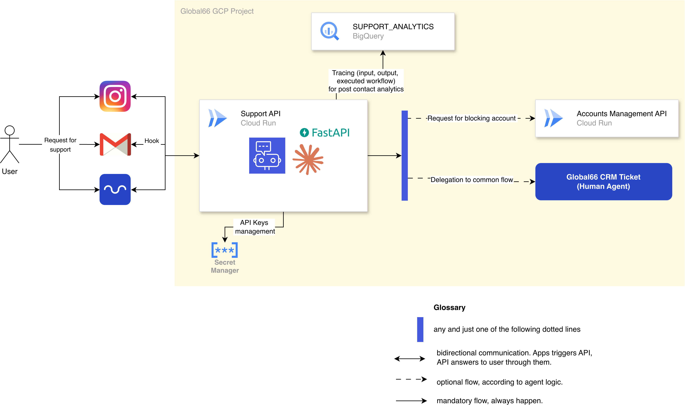

# Global66 Fraud Detection API

Sistema de primera línea de defensa para el equipo de soporte de Global66.
Clasifica mensajes entrantes por categoría, sentimiento y urgencia, y simula escalar automáticamente
los casos con evidencia de fraude activo.

**Stack:** Python 3.11 · FastAPI · Anthropic Claude · Pydantic v2 · Cloud Run

---

## Cómo navegar este repositorio

El proyecto tiene tres capas, pensadas para recorrerse en este orden:

### 1. Análisis exploratorio — `analysis.ipynb`

El punto de partida. El notebook carga la base de datos original
(`assets/Business tech case 1 - BBDD.xlsx`), clasifica todos los casos usando el LLM
y genera visualizaciones que identifican los principales puntos de dolor de los usuarios:
heatmaps de sentimiento, urgencia y riesgo por categoría y país.

También contiene la justificación de por qué se eligió abordar **SEGURIDAD/FRAUDE** como el problema
a automatizar y el contrato de la API que se construyó a partir de ese análisis.

### 2. La API — `src/`

Nombrada "Sofía" en honor al chatbot de Global66 en WhatsApp, donde esta lógica podría incorporarse
 algún día.

```
src/
├── api.py        # Rutas FastAPI (/sofia/classify, /sofia/memory, /health)
├── config.py     # Variables de entorno, cliente Anthropic, taxonomía
├── llm.py        # Llamada al LLM con tool_use para estructurar output y prompt caching
├── memory.py     # Persistencia en CSV (thread-safe)
└── models.py     # Enums, schemas de entrada/salida y schema interno del LLM
```

- `assets/system_prompt.txt` contiene el System Prompt. 
- `assets/categorias.json` contiene la taxonomía usada tanto en el notebook como en la API.

El endpoint principal es `POST /sofia/classify`. Recibe un mensaje de soporte (`INBOUND` o `OUTBOUND`),
lo acumula en memoria y, para mensajes `INBOUND`, analiza toda la conversación del caso con el LLM.
Devuelve un JSON con la polaridad de sentimiento detectado (`NEGATIVO`/`NEUTRAL`/`POSITIVO`), la categoría
y subcategoría de la intención del usuario según la taxonomía, un nivel de urgencia y una decision 
`keep_hearing` si considera que hasta el momento no se requiere tratamiento al fraude o `trigger_block` 
si lo detecta, junto con la respuesta sugerida para el usuario.

Para ejecutar la API con facilidad, se dispone de un archivo `Makefile`. Basta con ejecutar:
```bash 
make venv
source .venv/bin/activate
make install
make run
export ANTHROPIC_API_KEY=...
```

Y la API ya estará corriendo en local, exponiendo los siguientes endpoints:

- GET `/health`
- GET `/sofia/memory`
- DELETE `/sofia/classify/{case_id}`
- POST `/sofia/classify`

Siendo el último el más relevante. Para este, el esquema de entrada es el siguiente:

```json
{
    "case_id": "CASE-001",
    "message_id": "MSG-001",
    "user_id": "USR-772",
    "direction": "INBOUND",
    "text": "hola, me robaron ...",
    "platform": "instagram",
    "pais_usuario": "Chile",
}
```

La API responderá con un JSON indicando la decisión tomada para cada mensaje:

```json
{
    "case_id": "CASE-001",
    "message_id": "MSG-001",
    "decision": "keep_hearing",
    "sentiment": "POSITIVO",
    "category": "DESCONOCIDO",
    "subcategory": "DESCONOCIDO",
    "urgency": "BAJA",
    "text": "",
}
```

O bien

```json
{
    "case_id": "CASE-001",
    "message_id": "MSG-001",
    "decision": "trigger_block",
    "sentiment": "NEGATIVO",
    "category": "SEGURIDAD_FRAUDE",
    "subcategory": "ACCESO_NO_AUTORIZADO",
    "urgency": "CRITICAL",
    "text": "Para tu seguridad, hemos desactivado temporalmente tu cuenta. A continuación, ...",
}
```

Donde:
- `keep_hearing` representa delegar en flujo tradicional. Este caso no lleva `†ext` pues nuestro agente no interviene, pero sigue escuchando próximas interacciones.
- `trigger_block` representa triggerear el bloqueo de la cuenta. Este caso lleva `text` que corresponde a la intervención del agente para dar aviso al usuario de que su cuenta fue bloqueada y de los próximos pasos a seguir. 

### 3. Seed — `seed.py`

Script para pasar toda la base de datos por la API de una vez. Requiere que la API esté corriendo.

```bash
python seed.py                                              # defaults
python seed.py --url http://localhost:8080 --out outputs/resultados.csv
```

Al terminar exporta el estado completo de la memoria a un CSV con los mensajes y las decisiones
del modelo para cada uno.

## Usando el servicio deployeado

La API se encuentra también deployeada como Cloud Run Service en GCP.

> `https://sofia-901545252597.europe-west1.run.app`

Los endpoints son los mismos descritos para el caso local. 

### 4. Arquitectura de la solución

Las decisiones lógicas y arquitectónicas del proyecto se detallan en el archivo `analysis.ipynb`, sección 4. 
A modo de adelanto, a continuación se despliega el diagrama de arquitectura.



---

**Autor:** Matias Vergara · matiasjvs@gmail.com